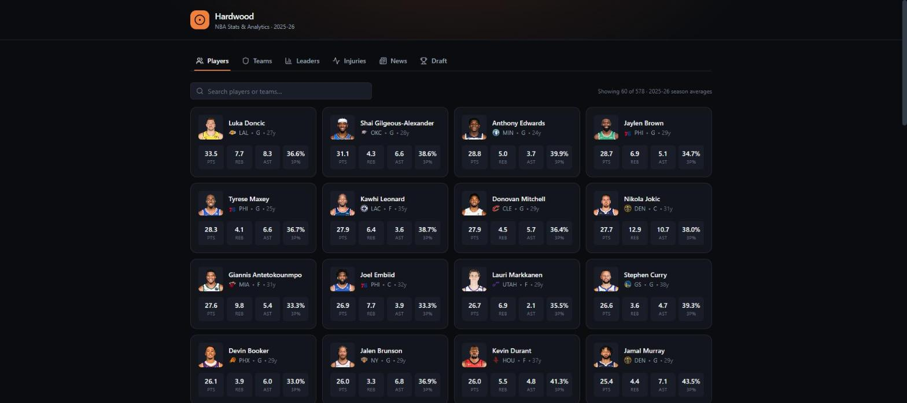

# Hardwood Analytics — NBA Stats & Analytics Dashboard

A live NBA **analytics** dashboard built with **React, Next.js, TypeScript, Tailwind CSS, and Radix UI**. It pulls real, current NBA data from public endpoints, normalizes it through a typed server-side layer, and turns it into an interactive front-office-style tool — not just a stats table, but computed efficiency metrics, percentile rankings, an efficiency-landscape explorer, a head-to-head comparison view, and a statistical similarity engine.

**Live demo:** https://nba-stats-dashboard-chi.vercel.app



---

## What it does

Eight sections, each a self-contained feature module sharing one design system:

| Tab | What it shows |
| --- | --- |
| **Players** | Searchable, sortable, position-filterable grid of ~580 players with 2025-26 season averages, plus animated league-leader tiles |
| **Teams** | Team picker → roster sorted by scoring, plus a **team-efficiency panel**: Offensive / Defensive / Net Rating (per 100 possessions) and estimated Pace |
| **Leaders** | Interactive ranked bar chart, toggleable across points, rebounds, assists, steals, and blocks |
| **Explore** | An **Efficiency Landscape** scatter/quadrant — every player plotted by scoring volume vs True Shooting %, with league-average crosshairs, colored by position, click-through to the player page |
| **Compare** | Pick two players → a **percentile radar** across six dimensions + a head-to-head table with the better mark highlighted per row |
| **Injuries** | Collapsible per-team panels + a **compare-two-teams-side-by-side** filter |
| **News** | Latest headlines with an **NBA / Summer League / G League** toggle |
| **Draft** | The full 2026 NBA Draft — picks, colleges, and drafting teams |

**Player detail page (modal — click any player anywhere):** percentile-ranked headline stats, **True Shooting %, Effective FG%, Usage Rate, and Game Score**, a scoring-breakdown bar, a **recent-form trend chart** (last 12 games), the **full shooting splits** (FG / 2P / 3P / FT with makes–attempts–%), the **OR/DR rebound split** and games started, a **season-by-season career history** table, and a **"most similar players"** engine.

All data is fetched at request time and cached; nothing is hard-coded or mocked.

## Analytics

This is the part that goes beyond rendering numbers. A documented, pure-function analytics module derives, from raw box-score data:

- **True Shooting %** and **Effective FG%** — shooting efficiency that accounts for 3s and free throws
- **Usage Rate** — a player's share of his team's possessions, from player-vs-team shot/turnover volume
- **Game Score** (Hollinger) — a single-number estimate of a game's productivity
- **Estimated possessions** (`FGA + 0.44·FTA − OREB + TOV`) and **per-100-possession Offensive / Defensive / Net Ratings** for teams
- **League percentile ranks** for every headline stat
- **Statistical similarity** — nearest-neighbor distance on percentile-normalized player profiles

When the true advanced metrics (PER, Win Shares, BPM, VORP) weren't available from a reliable *free* source, the choice was to compute correct metrics from the box score rather than wire a fragile dependency — all outputs cross-check against Basketball Reference.

## Architecture

The codebase is organized around a strict boundary between *the outside world* and *the UI*.

```
src/
├─ app/
│  ├─ api/                       # Route handlers: the ONLY thing that talks to the data source
│  │  ├─ players/route.ts        #   fetch → normalize → cache → typed JSON
│  │  ├─ players/[id]/gamelog/   #   per-player game log (lazy)
│  │  ├─ players/[id]/stats/     #   per-player season history (lazy)
│  │  ├─ teams/route.ts · team-stats/route.ts
│  │  ├─ injuries/route.ts · news/route.ts · draft/route.ts
│  │  ├─ layout.tsx              # React Query provider, metadata
│  │  └─ page.tsx
├─ lib/
│  ├─ types.ts                   # Clean domain models — the app's vocabulary
│  ├─ analytics.ts               # Pure basketball math (TS%, ratings, usage, game score)
│  ├─ playerAnalytics.ts         # Percentile ranks + similarity engine
│  ├─ espn/{client,mappers}.ts   # Low-level fetch + raw JSON → domain models (defensive)
│  └─ api-client.ts              # Typed client the UI calls (never fetches upstream directly)
├─ hooks/useNbaData.ts           # React Query hooks
├─ components/
│  ├─ ui/                        # Design system: Card, Dialog, Select, Avatar, …
│  ├─ features/                  # One module per tab + the player detail modal
│  └─ Dashboard.tsx              # Tabbed shell (Radix Tabs)
```

**Why the proxy layer?** Every upstream call goes through a Next.js route handler rather than the browser:

- **Secrets stay server-side.** The public data source used here is keyless, but the moment an API key were required it would live in this layer and never reach the client — the request shape wouldn't change.
- **CORS is a non-issue**, because the browser only ever calls same-origin `/api/*`.
- **Caching is centralized** at the edge (`s-maxage` + `stale-while-revalidate`).
- **The UI is insulated from the upstream shape.** The raw upstream JSON is messy and undocumented; the mapper layer turns it into clean, strictly-typed domain models. If the data source changed tomorrow, only the mappers would move.

## Performance

Frontend performance was a first-class concern:

- **Minimal re-renders.** Player cards are `React.memo`'d, so typing in search never re-renders the cards on screen.
- **Responsive search over ~580 players** via `useDeferredValue`; derived/sorted lists memoized with `useMemo`.
- **Server-side pagination aggregation** — the stats endpoint is paginated; the route handler pulls every page once, caches it, and hands the client a single array.
- **Lazy per-player endpoints** — game log and season history are fetched only when a player's modal opens.
- **Aggressive client cache** — React Query with a 5-minute `staleTime` and `refetchOnWindowFocus: false`.
- **Zero web-font payload** (system font stack) and **lazy, explicitly-sized media** to prevent layout shift.

## Design system

A small `components/ui/` layer defines the shared vocabulary — `Card`, `Badge`, `Select`, `Dialog`, `SegmentedControl`, `Avatar`, `Skeleton`, and consistent loading / empty / error states. Everything reads from a single set of CSS design tokens, so the entire product can be re-skinned from `globals.css`. Interactive primitives (Select, Tabs, Dialog) are built on **Radix UI** for accessibility and keyboard support out of the box, and motion respects `prefers-reduced-motion`.

## Tech stack

Next.js 16 (App Router) · React 19 · TypeScript (strict) · Tailwind CSS v4 · Radix UI · TanStack React Query · Recharts

## Running locally

```bash
npm install
npm run dev
# open http://localhost:3000
```

```bash
npm run build   # production build + type check
npm run lint    # eslint
```

---

*Data via ESPN's public endpoints. This project is a technical demonstration and is not affiliated with or endorsed by the NBA or ESPN.*
